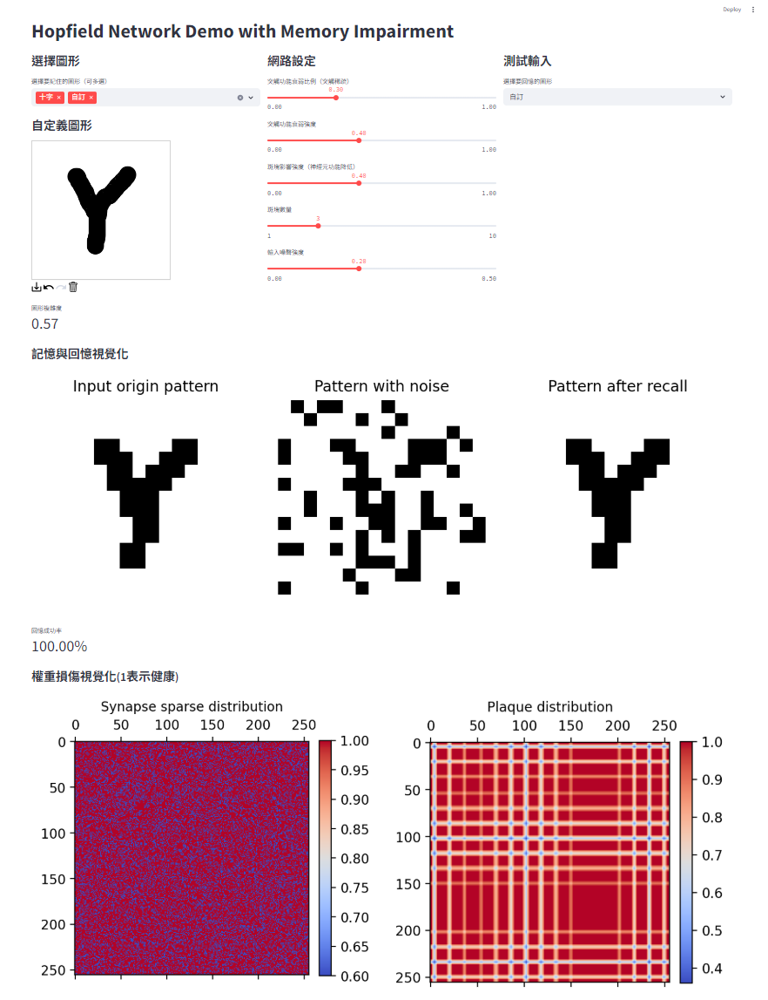

**This is the project of 2025 Neurophysik introduction class.**

# Hopfield amnesia model

This model is designed based on classical Hopfield network. We additionally add two parameters(synapse sparse and plaque) to control its amnesia behavior. It makes a vitualization of how these parameters influence the memory of Hopfield network.



## Install

Before executing the code. you may need to install two modules

```
pip install streamlit                 # for visualization
pip install streamlit_drawable_canvas # for drawing a picture to test model
```

## Usage

There are two types of model to simulate the Hopfield network.

  - **輕量化網站**: Can use the picture already preppared to test the model. Execution time is small.
  - **完整版程式碼**: Can adjust neuron numbers and randomly generating pictures. Taking more execution time.

You need to download whole files of each model to execute it successfully. After download, opening the terminal to the folder you just download.

```
# example
cd C:\Users\User\...\輕量化網站 # The path to the folder
```

If you opened it by vscode, it usually defualt to open the terminal in the correct path. Then run the following code to open the demo website.

  - For **輕量化網站**:

  ```
  streamlit run .\demo_test.py
  ```

  - For **完整版程式碼**:
  ```
  streamlit run .\demo.py
  ```
